# Projecte-SASS-Aaron-i-Mike
Aquest és el Markdown sobre el nostre projecte, que tracta sobre crear una pàgina web sobre la història de la computació utilitzant SASS com a preprocesador CSS.

Per això, primer de tot, entre els membres del grup vam escollir les diferents característiques visuals que tindrà la nostra pàgina web i vam implementar funcionalitats avançades de SASS per millorar l'organització i manteniment del codi.

## Menú
- [Descripció del projecte](#descripció-del-projecte)
- [Paleta de colors](#paleta-de-colors)
- [Disseny de la pàgina principal](#disseny-de-la-pàgina-principal)
- [Disseny de les pàgines d'article](#disseny-de-les-pàgines-darticle)
- [Variables SASS](#variables-sass)
- [Estructura del projecte](#estructura-del-projecte)
- [Característiques SASS implementades](#característiques-sass-implementades)
- [Contingut dels articles](#contingut-dels-articles)
- [Compilació i ús](#compilació-i-ús)

## Descripció del projecte

**"THE HISTORY"** és una pàgina web sobre la història de la computació desenvolupada amb HTML5, SCSS i CSS3. El projecte recorre les diferents èpoques de la informàtica, des de l'era mecànica fins a la computació en núvol i intel·ligència artificial.

### Funcionalitats principals:
- **Mode clar/fosc**: Botó per canviar entre els dos temes visualment diferents
- **8 articles detallats**: Cada un cobreix una època diferent de la història de la computació
- **Disseny responsive**: S'adapta a diferents dispositius i mides de pantalla
- **Navegació intuïtiva**: Enllaços entre articles i pàgina principal

## Paleta de colors

En aquest apartat expliquem la paleta de colors utilitzada en el nostre projecte **"THE HISTORY"**, una pàgina web sobre la història de la computació desenvolupada amb HTML5, SCSS i CSS3.

Hem triat una paleta que permet visualitzar la pàgina en **dos modes diferents**: mode clar i mode fosc, donant a l'usuari la possibilitat de triar la seva preferència visual.

### Mode Clar
- **Fons principal**: `#ffffff` (Blanc pur)
- **Color de text**: `#1a1a2e` (Gris fosc quasi negre)
- **Fons de targetes**: `#f7f7fc` (Gris clar lleuger)
- **Color accent**: `#5a52ff` (Blau/morat vibrant)
- **Ombra**: `rgba(0, 0, 0, 0.06)` (Ombra suau)

### Mode Fosc
- **Fons principal**: `#0a0a0f` (Negre profund)
- **Color de text**: `#e8e8f2` (Gris clar/blanc)
- **Fons de targetes**: `rgba(20, 20, 32, 0.6)` (Gris fosc translúcid)
- **Color accent**: `#5a52ff` (Blau/morat vibrant - es manté igual)
- **Ombra**: Més pronunciada en mode fosc

### Elements destacats
- **Títol principal**: `#9b97ff` - Color del títol "THE HISTORY", variant més clara del color accent
- **Transicions**: Tots els canvis de color tenen una transició suau de 0.3s
- **Botó de tema**: Utilitza el color accent i canvia segons el mode actiu

### Captura de pantalla - Mode Clar
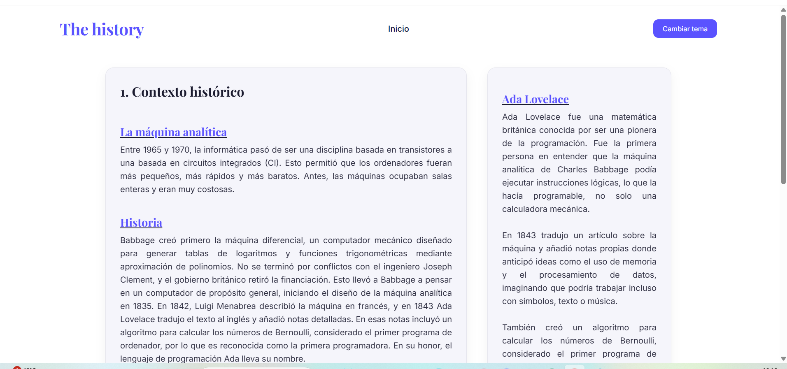

### Captura de pantalla - Mode Fosc
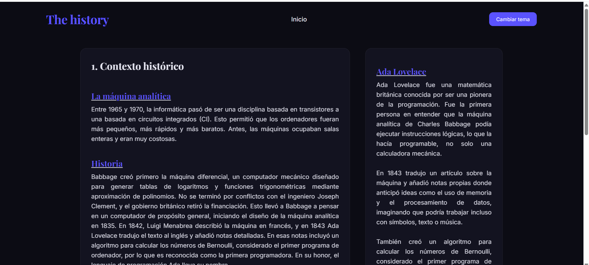

## Disseny de la pàgina principal

La pàgina principal (`index.html`) conté una estructura ben organitzada que mostra tots els articles de manera visual i atractiva.

### Estructura del layout:
- **Header**: Conté les xarxes socials, el títol "THE HISTORY" centrat i el botó de canvi de tema
- **Secció d'introducció**: Text explicatiu sobre el contingut de la pàgina
- **Grid d'articles**: Targetes amb informació resumida de cada època històrica
- **Sidebar**: Informació sobre els autors del projecte
- **Footer**: Informació de drets d'autor

### Captura completa de la pàgina principal
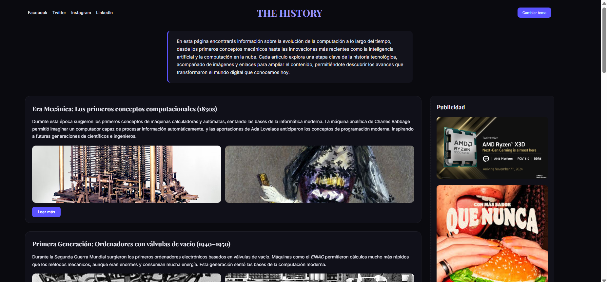

### Detall del Header


### Detall de les targetes d'articles
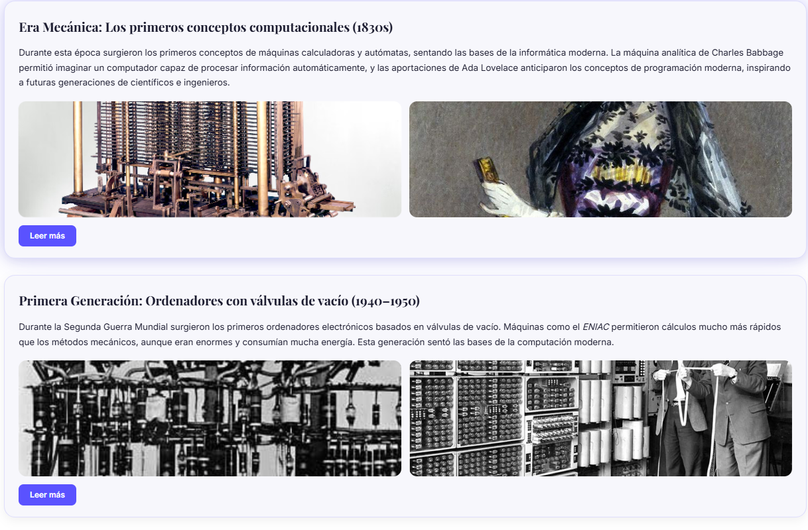

## Disseny de les pàgines d'article

Cada article individual té el seu propi disseny optimitzat per a la lectura de contingut llarg.

### Característiques del disseny:
- **Header simplificat**: Amb navegació per tornar a la pàgina principal
- **Contingut estructurat**: Títols, paràgrafs i imatges il·lustratives
- **Tipografia llegible**: Mides de font optimitzades per a lectura
- **Espaiat generos**: Per facilitar la lectura i comprensió

### Exemple de pàgina d'article


### Detall del contingut de l'article


## Variables SASS

Una de les característiques més potents de SASS són les variables, que ens permeten mantenir consistència en tot el projecte i facilitar els canvis futurs.

### Variables principals utilitzades en `style.scss`:
```scss
// Colors mode clar
$bgL: #ffffff;          // Fons clar
$txL: #1a1a2e;          // Text clar
$cdL: #f7f7fc;          // Targetes clares

// Colors mode fosc
$bgD: #0a0a0f;          // Fons fosc
$txD: #e8e8f2;          // Text fosc
$cdD: rgba(20, 20, 32, 0.6);  // Targetes fosques

// Colors accent i comuns
$ac: #5a52ff;           // Color accent
$acS: rgba($ac, 0.15);  // Accent suau
$sh: 0 6px 18px rgba(0, 0, 0, 0.06);  // Ombra
$rd: 20px;              // Border radius
```

### Variables utilitzades en `articulo.scss`:
```scss
$bg: #ffffff;           // Fons
$bgD: #0c0c14;          // Fons fosc
$tx: #1b1b2f;           // Text
$txD: #e4e4ef;          // Text fosc
$cd: #f5f5fb;           // Targetes
$cdD: rgba(24, 24, 40, .6);  // Targetes fosques
$ac: #5a52ff;           // Accent
$sh: 0 8px 20px rgba(0, 0, 0, .05);  // Ombra
$rb: 10px;              // Border radius petit
$rc: 16px;              // Border radius mitjà
```

Aquestes variables permeten canviar els colors de tota la pàgina modificant només un valor, i faciliten la consistència visual en tot el projecte.

## Estructura del projecte

```
Proyecto-SASS/
│
├── index.html              # Pàgina principal amb tots els articles
├── style.scss              # Fitxer SASS de la pàgina principal
├── style.css               # CSS compilat de la pàgina principal
│
├── articulo.html           # Article 1: Era Mecánica (1830s)
├── articulo2.html          # Article 2: Primera Generació (1940s)
├── articulo3.html          # Article 3: Segona Generació (1950s-1960s)
├── articulo4.html          # Article 4: Tercera Generació (1960s-1970s)
├── articulo5.html          # Article 5: Quarta Generació (1970s-1980s)
├── articulo6.html          # Article 6: Era de l'Internet (1990s)
├── articulo7.html          # Article 7: Era mòbil (2000s)
├── articulo8.html          # Article 8: Núvol i IA (2010s-actualitat)
│
├── articulo.scss           # Fitxer SASS per als articles
└── articulo.css            # CSS compilat per als articles
```

## Característiques SASS implementades

### Nesting (Anidament)
Organització jeràrquica dels estils seguint l'estructura HTML:

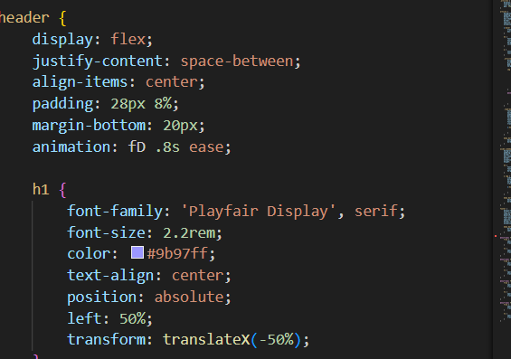

### Operacions amb colors
Utilització de funcions RGBA amb variables:

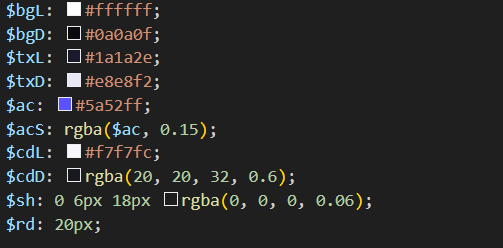

### Pseudo-classes amb &
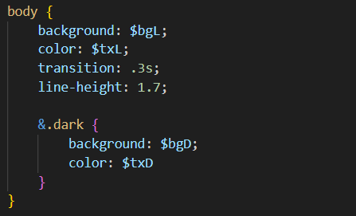

### Animacions
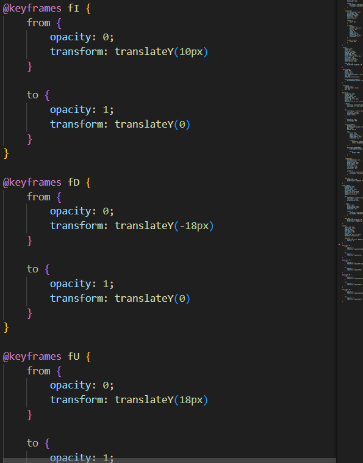

## Contingut dels articles

Cada article explora una època clau en la història de la computació:

### 1. Era Mecánica (1830s)
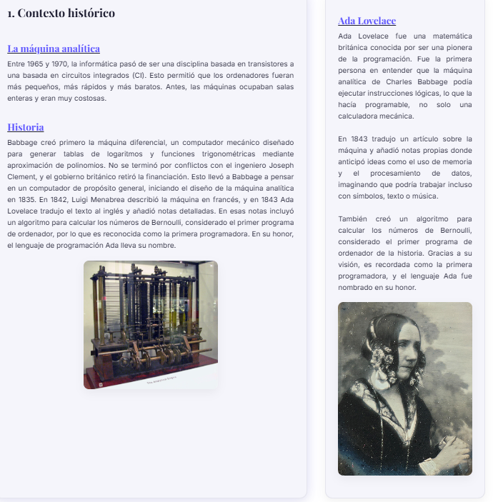
**articulo.html** - Els primers conceptes computacionals

### 2. Primera Generació (1940s)
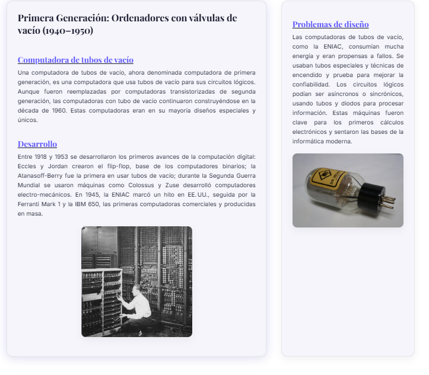
**articulo2.html** - ENIAC i les primeres computadores

### 3. Segona Generació (1950s-1960s)
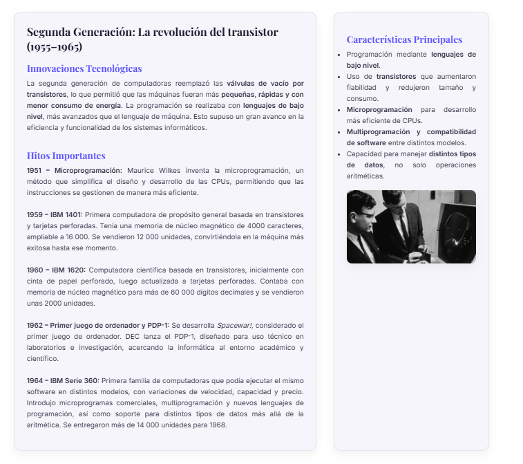
**articulo3.html** - Transistors i mainframes

### 4. Tercera Generació (1960s-1970s)
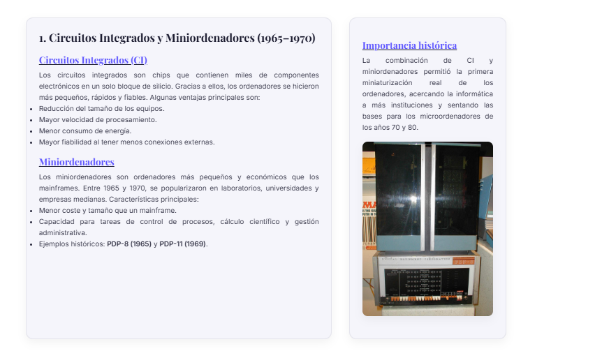
**articulo4.html** - Circuits integrats

### 5. Quarta Generació (1970s-1980s)
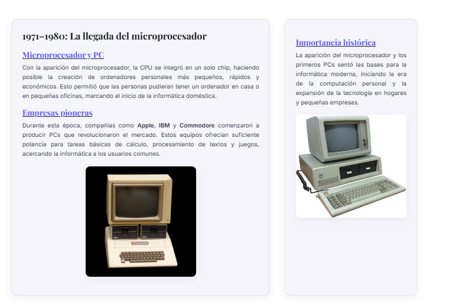
**articulo5.html** - Microprocessadors i PCs

### 6. Era de l'Internet (1990s)
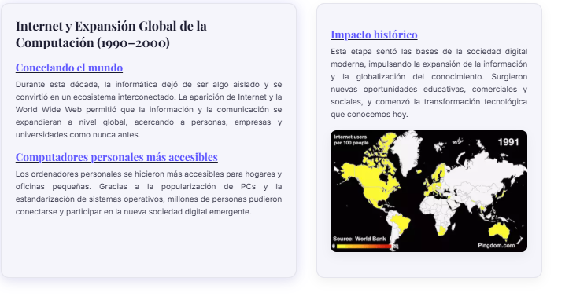
**articulo6.html** - La revolució d'Internet

### 7. Era mòbil (2000s)
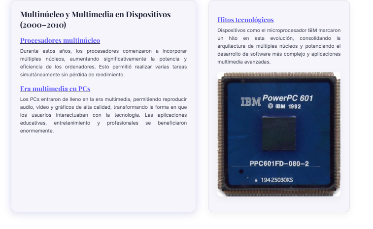
**articulo7.html** - Smartphones i mobilitat

### 8. Núvol i IA (2010s-actualitat)
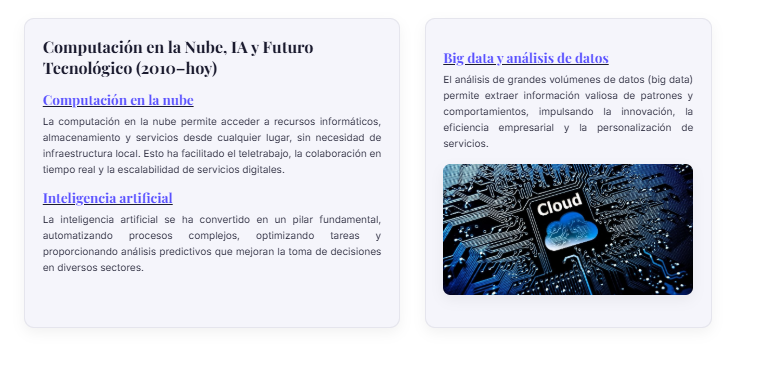
**articulo8.html** - Computació en núvol i intel·ligència artificial

---

**Autors**: Aaron i Mike  
**Repositori**: [MikeGC18/Proyecto-SASS](https://github.com/MikeGC18/Proyecto-SASS)
